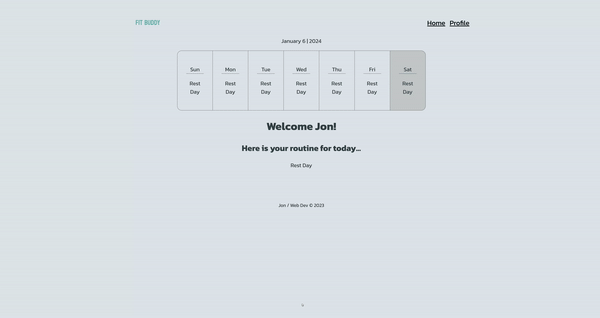
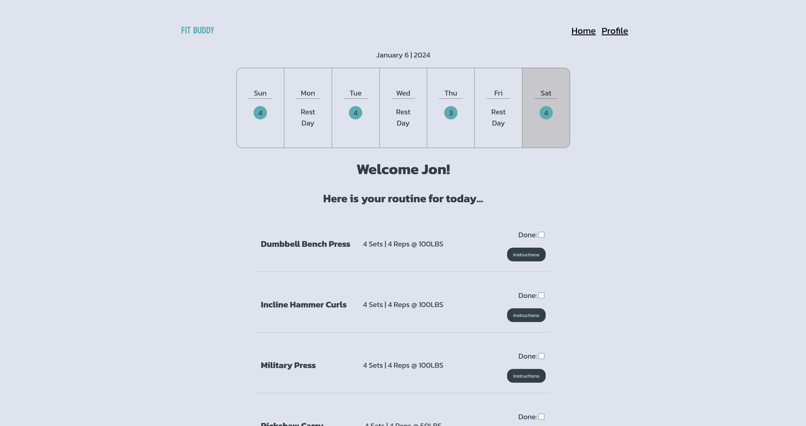
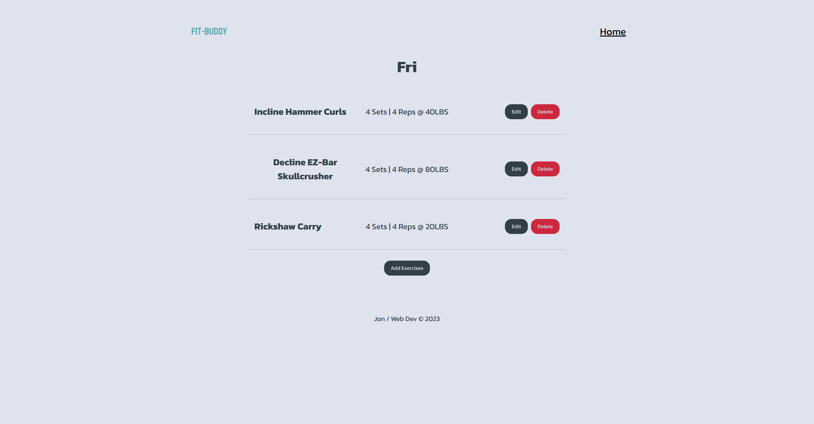
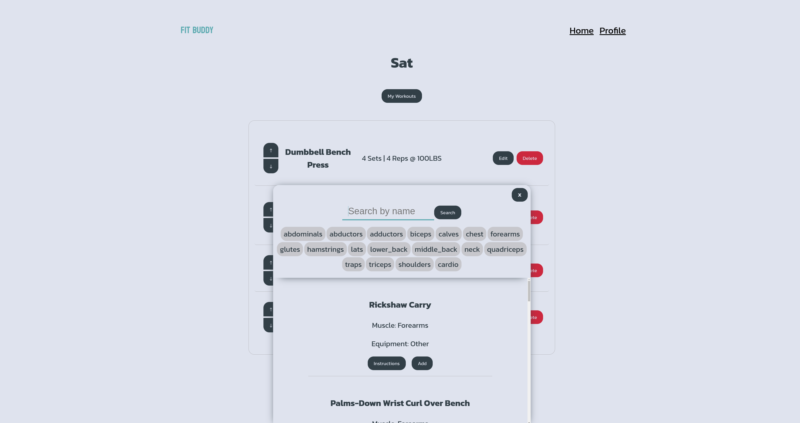

[LinkedIn](https://www.linkedin.com/in/jonathanvillagomezhernandez/) |
[Website](https://www.jonweb.dev/)

<!-- PROJECT LOGO -->
 

  <h1 align="center">Fit Buddy</h3>

  

    An application used to set up your workout routine for the week!
     
    <a href="https://fitbuddyapp.netlify.app/"><strong>View Demo</strong></a>
     
  

<!-- TABLE OF CONTENTS -->

  
Table of Contents

  <ol>
    <li>
      <a href="#about-the-project">About The Project</a>
      <ul>
        <li><a href="#built-with">Built With</a></li>
      </ul>
    </li>
  </ol>

<!-- ABOUT THE PROJECT -->
## About The Project

  

  

  

  

Fit Buddy, a web app meticulously crafted for scheduling and organizing personalized workout routines. Developed using Vue and SCSS, the application's intuitive home screen provides a clear daily overview of your workout schedule. Elevate your fitness experience by seamlessly planning and tracking your workouts, making Fit Buddy the perfect companion for your health and wellness goals.

(<a href="#readme-top">back to top</a>)

### Built With

* Vue
* SCSS

(<a href="#readme-top">back to top</a>)

